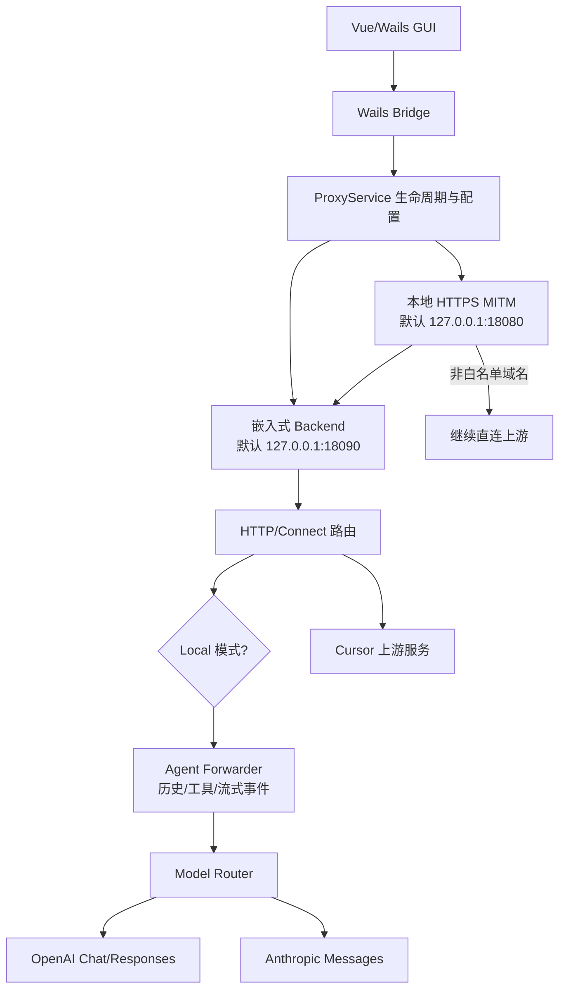

# Cursor助手（cursor-byok）源码分析报告

> 本报告基于仓库当前源码、配置文件和构建脚本整理，重点回答三个问题：**这个项目做什么、它如何工作、如何运行**。文件路径均以仓库根目录为基准。

## 1. 结论先行

这是一个 **Go + Wails + Vue 的桌面应用**，核心目标是把 Cursor 的 Agent 请求与 Cursor 自带的模型服务解耦：

```text
Cursor
  -> 本地 HTTPS MITM 代理
  -> 嵌入式 Backend（兼容 Cursor 协议）
  -> Agent/工具/历史处理层
  -> OpenAI 或 Anthropic 兼容 API
```

用户可以在 GUI 中配置多个模型渠道（API Key、Base URL、模型 ID、上下文窗口、推理参数等），然后让 Cursor 的 Agent 使用这些渠道。项目并非简单的“API Key 配置器”，而是一个本地协议兼容、请求路由、流式事件转换和工具执行系统。

它还保留了部分请求的 Cursor 上游转发能力，并提供独立的 `cursor-tab-server`，用于处理 Cursor Tab 等不完全属于本地 Agent 链路的请求。

## 2. 项目要解决的问题

项目 README（[`README.md`](../README.md)）的核心诉求是解除“Agent 服务、模型、订阅和计费方式”之间的绑定：

- 让开发者自由选择模型供应商和模型。
- 将 OpenAI 兼容或 Anthropic 兼容 API 接入 Cursor 等开发工具。
- 让既有模型额度得到更充分利用。
- 保留扩展到更多 IDE、Chat、Agent 和自托管场景的可能性。

因此，它本质上是一个 **面向 Cursor 的 BYOK（Bring Your Own Key）本地适配层**，而不是一个新的大模型服务。

## 3. 技术栈与总体结构

### 3.1 技术栈

| 层次 | 技术/组件 | 作用 |
| --- | --- | --- |
| 桌面壳 | Wails v3 alpha.74 | 将 Go 服务和 Vue 前端打包成桌面应用 |
| 后端 | Go 1.25 | 生命周期、代理、HTTP 服务、协议和模型适配 |
| 前端 | Vue、Vite、Tailwind | 配置、服务状态、统计和模型管理界面 |
| HTTP 路由 | chi、Connect RPC | HTTP、Connect unary/stream 路由 |
| 代理 | `elazarl/goproxy` | HTTPS MITM 和请求转发 |
| 协议 | Protobuf/Connect、JSON、SSE | Cursor 请求、流式响应和工具事件 |
| 配置 | YAML | 模型渠道、路由、监听地址和日志配置 |
| 存储 | SQLite、JSON、文件 | Cursor 状态、历史、索引、用量和运行数据 |

入口依赖见 [`go.mod`](../go.mod)、[`frontend/package.json`](../frontend/package.json)。

### 3.2 目录职责

| 目录/文件 | 职责 |
| --- | --- |
| [`main.go`](../main.go) | 嵌入前端资源并启动 Wails 应用 |
| [`internal/app/runner.go`](../internal/app/runner.go) | 应用总装配：窗口、托盘、代理、Backend、事件和生命周期 |
| [`frontend/`](../frontend/) | Vue 页面、状态、Wails API 调用和模型配置界面 |
| [`internal/bridge/`](../internal/bridge/) | 暴露给前端的 Proxy、窗口、统计、广告等 Wails 服务 |
| [`internal/client/`](../internal/client/) | 配置加载、启动/停止代理、健康检查、Cursor 设置注入 |
| [`internal/mitm/`](../internal/mitm/) | 本地 HTTPS MITM 代理和到 Backend 的 relay |
| [`internal/backend/host.go`](../internal/backend/host.go) | 在应用进程内启动 HTTP Backend |
| [`internal/backend/server/`](../internal/backend/server/) | 路由、上下文、中间件、Local/Upstream 策略和配置管理 |
| [`internal/backend/forwarder/`](../internal/backend/forwarder/) | Cursor Agent、历史、工具、流式响应和 Provider 调度 |
| [`internal/backend/agent/model/`](../internal/backend/agent/model/) | 统一模型接口以及 OpenAI/Anthropic adapter |
| [`internal/cursor/`](../internal/cursor/) | 修改/恢复 Cursor 的代理和网络设置 |
| [`internal/certs/`](../internal/certs/) | CA 证书管理，用于 HTTPS MITM |
| [`internal/appdata/paths.go`](../internal/appdata/paths.go) | 统一管理配置、历史、日志和数据路径 |
| [`cursor-tab-server/`](../cursor-tab-server/) | 独立的 Cursor Tab 上游转发服务 |
| [`proto/`](../proto/) | Agent、AI Server 和工具相关协议定义 |
| [`build/`](../build/) | Wails、平台打包、生成代码和交叉编译配置 |

## 4. 总体架构



### 4.1 两种路由模式

- **local**：Cursor 请求被本地 Backend 接管，Agent 请求进入 forwarder，最终调用用户配置的模型 API。
- **upstream**：请求按照路由配置转发到 Cursor 原生上游；没有对应上游 action 的路由会报错，而不是静默猜测。

此外，MITM 对非白名单域名通常不解密、不改写，交给 goproxy 继续直连。这使应用可以只接管需要兼容的 Cursor 域名，降低对其他网络流量的影响。

## 5. 核心原理

### 5.1 启动两个本地服务

[`internal/client/lifecycle.go`](../internal/client/lifecycle.go) 的 `StartProxy` 大致按以下顺序工作：

1. 读取并校验用户配置。
2. 创建并启动嵌入式 Backend。
3. 轮询 Backend 的 `/healthz`，确认它已经监听。
4. 根据配置创建或更新 MITM Proxy。
5. 应用 Cursor 账号/代理相关设置。
6. 启动 MITM 监听器。
7. 将代理设置写入 Cursor，并向前端广播 `ProxyState`。

停止时反向清理：停止 MITM、恢复 Cursor 设置、停止 Backend、清除错误状态。

默认地址来自 [`internal/backend/server/config/types.go`](../internal/backend/server/config/types.go)：

```text
Proxy   127.0.0.1:18080
Backend 127.0.0.1:18090
```

### 5.2 HTTPS MITM 和原始 URL relay

[`internal/mitm/service.go`](../internal/mitm/service.go) 使用 goproxy：

1. 对白名单 CONNECT 域名使用 MITM，利用应用 CA 解密 HTTPS。
2. 删除客户端伪造的原始上游 URL header。
3. 解析请求目标，并保存真实上游地址。
4. 将请求的 path、raw path、query 复制到 Backend 地址。
5. 复制请求头，清除 hop-by-hop headers。
6. 注入内部 `HeaderServerUpstreamURL`，让 Backend 知道请求原本要访问哪个 Cursor 服务。
7. 转发到 Backend，并清理返回响应中的 hop-by-hop headers。

MITM 层不解析 Agent JSON，也不理解模型协议；它只负责 TLS、域名筛选和 relay。协议理解集中在 Backend。

### 5.3 Backend 路由：本地处理与上游处理

[`internal/backend/server/route.go`](../internal/backend/server/route.go) 将每个路由表示为可组合的 `Route`，路由可以声明：

- `Local`：本地 handler。
- `Upstream`：真实 Cursor 上游 handler。
- middleware。
- HTTP、Connect unary 或 Connect stream 协议类型。

`buildRouteHandler` 根据请求上下文的 mode 选择 action：

```text
ModeUpstream 且存在 Upstream action -> 上游
ModeUpstream 但没有 action          -> 明确错误
其他情况                            -> Local
```

这种设计把“走本地还是走上游”的决策放在统一路由层，不让每个业务 handler 各自实现一套分流逻辑。

### 5.4 Cursor Agent 请求的处理

Agent 主链路位于 [`internal/backend/forwarder/`](../internal/backend/forwarder/)：

```text
BidiAppend / RunSSE
  -> 解析 Cursor 请求
  -> 写入/读取 conversation history
  -> PromptCompiler 编译 system prompt、规则、历史和工具
  -> HistoryProjector 规范化 replay
  -> 计算上下文窗口和输出 token 预算
  -> ProviderGateway 启动模型流
  -> Provider 事件统一化
  -> 工具执行或向 Cursor 发布流事件
```

`NewModule` 会把 forwarder 装配成 Bidi、RunSSE、AI、Repository 和 Upload 等 handler。这样 Cursor 看到的仍然是它预期的协议，而模型供应商只需要满足 OpenAI/Anthropic 其中一种兼容协议。

### 5.5 统一消息模型与 Provider 路由

[`internal/backend/agent/model/types.go`](../internal/backend/agent/model/types.go) 定义统一的 `Message` 和 `ModelEvent`：

- 消息支持文本、图片、reasoning、签名、工具调用和工具结果。
- 事件统一表示文本增量、思考增量、工具调用增量、回合结束、usage 和错误。
- Provider 特有的 Responses item ID、reasoning metadata 等不会被简单丢弃，便于下一次 replay。

[`router.go`](../internal/backend/agent/model/router.go) 先调用 `ChannelResolver.SelectChannelForModel`：

```text
Cursor 模型标识
  -> 本地 ModelAdapter 渠道
  -> provider/base URL/API Key/真实模型 ID
  -> 上下文窗口、token 限额、reasoning 和额外参数
  -> 消息清洗
  -> OpenAI 或 Anthropic adapter
```

消息清洗会移除 replay-only placeholder、合并相邻 assistant tool calls、裁剪 dangling tool calls 和末尾 assistant prefill，避免不同供应商拒绝不合法的消息序列。

### 5.6 OpenAI 兼容适配

[`openai.go`](../internal/backend/agent/model/openai.go) 根据 endpoint 形态选择：

- **Chat Completions**：构造 `messages`、`tools`、`max_tokens`、`reasoning_effort`，并可设置 `prompt_cache_key`。
- **Responses API**：保留 provider item/call/status、reasoning summary、工具参数和图像生成状态，用于无状态 replay。

两者都支持流式 HTTP 响应、重试和 idle watchdog。Chat Completions 的 SSE 解析会累积工具参数；`openAIThinkTagParser` 还能将某些服务返回的 `<think>...</think>` 内容拆成统一的 thinking 事件。

### 5.7 Anthropic 兼容适配

[`anthropic.go`](../internal/backend/agent/model/anthropic.go) 将统一消息转换为 Anthropic Messages：

- system 内容转换为 Anthropic system blocks。
- OpenAI 风格 function tools 转为 Anthropic tools。
- 根据配置生成 thinking、`max_tokens` 和 cache breakpoint。
- 添加 `x-api-key`、`anthropic-version` 等请求头。
- 解析 `content_block_*`、`message_delta`、`message_stop` 等 SSE 事件。

Anthropic 的 `partial_json` 会累积成完整工具参数，并发出统一的 partial/tool completed 事件；thinking signature、输入/输出 token 和 cache token 也会回传。

### 5.8 工具调用和事件回流

Provider stream 不直接修改共享状态，而是把事件送回 forwarder 的串行 actor。`applyProviderModelEvent` 的行为包括：

- 文本/思考增量：累积并通过 broker 发布给 Cursor。
- thinking 完成：保存签名和 Responses metadata。
- 工具参数增量：转换为 Cursor 可理解的工具事件。
- 工具完成：先持久化尚未刷出的 assistant 文本，再统一为 `runtimecore.ToolInvocation`，交给 shell、文件编辑、计划、子 Agent 或其他 interaction handler。
- 回合结束：保存 provider、model、finish reason 和 token usage。
- provider error：终止当前 provider loop，并向客户端返回错误。

这解释了为什么项目不仅能“聊天”，还可以继续支持 Cursor Agent 的工具循环：模型输出工具调用，forwarder 执行工具，再把结果写回历史并启动下一轮模型请求。

### 5.9 历史 replay、压缩和缓存稳定性

[`projector.go`](../internal/backend/forwarder/projector.go) 将 JSON history entry 投影为模型消息，处理 user/request context、assistant text、tool call/result、summary 等类型，并负责：

- tool call 与 tool result 配对。
- 去重和重复调用处理。
- 合并 assistant 工具调用批次。
- 重排交错 tool result。
- 裁剪未完成的 dangling tool call。
- 保留必要的 reasoning metadata。

[`compiler.go`](../internal/backend/forwarder/compiler.go) 再加入 system prompt、共享规则和工具 catalog，生成 `CompiledConversation`。当上下文过长时，forwarder 会根据 context window 触发 compaction/summary，并动态计算输出 token 预算。

项目特别维护 `stable message count` 和 `previous cache frontier`：

- 已稳定的历史前缀保持 append-only。
- 动态上下文不随意插入历史前缀。
- OpenAI 使用 `prompt_cache_key`，Anthropic 使用 cache breakpoint。
- 后续请求可复用尽量长的 prompt cache 前缀。

这是一项性能和成本优化，也是协议适配的重要组成部分。

## 6. 端到端数据流

### 6.1 GUI 配置保存

```text
ModelEditor.vue
  -> frontend/src/services/clientApi.js
  -> Wails generated bindings
  -> internal/bridge/proxy.go
  -> internal/client config API
  -> backend/server/config Store/Manager
  -> ~/.cursor-local-assistant-v2/config.yaml
```

### 6.2 Agent 请求和模型响应

```text
Cursor Agent
  -> Proxy :18080
  -> Backend :18090
  -> Route（Local）
  -> Bidi/RunSSE forwarder
  -> history + compiler + projector
  -> ChannelResolver
  -> OpenAI/Anthropic API
  -> SSE/JSON 流
  -> ModelEvent
  -> forwarder actor
  -> Cursor 流事件 / ToolInvocation
```

### 6.3 工具循环

```text
模型输出 tool call
  -> forwarder 累积参数
  -> 执行 shell/文件/交互工具
  -> 保存工具调用与结果
  -> 更新 conversation history
  -> 重新编译稳定 prompt
  -> 下一轮 Provider stream
```

### 6.4 上游和 Tab 请求

未被本地 Agent 接管的接口可进入 upstream action。独立 [`cursor-tab-server/main.go`](../cursor-tab-server/main.go) 默认监听 `:8041`，按请求路径将 Cursor Tab 请求转发到 `api2.cursor.sh`、`api3.cursor.sh`、`api4.cursor.sh` 等上游，并注入 `Authorization` 与 `x-cursor-checksum`。

## 7. 配置与持久化

### 7.1 主要配置

配置类型在 [`internal/backend/server/config/types.go`](../internal/backend/server/config/types.go)，通常包含：

- `BackendListenAddr`、`ProxyListenAddr`。
- 日志和 provider stream idle timeout。
- `ModelAdapters`：展示名、provider 类型、Base URL、API Key、模型 ID、自定义 headers。
- OpenAI endpoint、reasoning effort 和 extra params。
- Anthropic thinking/max tokens。
- context window、max completion tokens。
- local/upstream routing。
- 使用量统计和最近模型状态。

保存前会规范化地址、校验 provider、检查 URL/API Key/model ID、解析 JSON 参数、校验自定义 header，并生成稳定的渠道 ID。

### 7.2 模型渠道选择

同一个 Cursor 模型名可以映射到本地渠道。解析器负责将“Cursor 请求里的模型标识”转换为：

```text
provider 类型 + Base URL + API Key + 实际模型 ID + token/reasoning 参数
```

因此，Cursor 不需要知道用户实际调用的是哪家兼容服务。

### 7.3 数据目录

[`internal/appdata/paths.go`](../internal/appdata/paths.go) 将数据集中在：

```text
~/.cursor-local-assistant-v2/
```

典型内容：

```text
config.yaml              模型和运行配置
history/                 会话历史、工具结果、prompt replay
history/usage.json       token 和会话统计
logs/                    运行日志
rules/                   用户规则
data/ca.crt               MITM CA 证书
data/ads/                 广告缓存
data/codebase-index/      代码库索引
data/docs-index/          文档索引
```

> 实际路径由代码按平台数据目录规则决定；上面是默认/典型布局。API Key、Cursor token、CA 私钥和历史内容都应视为敏感数据，不要提交到 Git 或共享日志。

### 7.4 Cursor 设置注入

服务启动时 [`internal/cursor/settings.go`](../internal/cursor/settings.go) 可能写入：

- `http.proxy`
- `http.proxyKerberosServicePrincipal`
- `http.proxySupport`
- `cursor.general.disableHttp2`
- `http.experimental.systemCertificatesV2`

停止时会清理这些由应用注入的设置。证书复制到用户数据目录后，Cursor 才能信任 MITM 连接。

## 8. 如何运行

> 仓库根部 [`README.md`](../README.md) 主要介绍项目愿景，没有完整的安装手册。以下命令来自 [`Taskfile.yml`](../Taskfile.yml)、[`build/Taskfile.yml`](../build/Taskfile.yml) 和前端配置，适合开发者按源码运行。

### 8.1 前置依赖

至少需要：

- Go 1.25.0。
- Node.js、Yarn。
- Task。
- Wails 3 CLI（项目使用 `v3.0.0-alpha.74` 依赖）。
- `protoc`、`protoc-gen-go`、`protoc-gen-connect-go`（重新生成协议代码时需要）。
- Windows WebView2（Windows 桌面运行/构建所需）。
- Git Bash/MSYS2 或其他能提供 `mkdir`、`rm`、`cp`、`zip`、`test`、`which` 等命令的环境。

Windows 构建脚本 [`build.bat`](../build.bat) 和 [`build.ps1`](../build.ps1) 会将 `%USERPROFILE%/go/bin`（对应 `$HOME/go/bin`）加入 PATH 后调用 Task。

### 8.2 开发模式（推荐先验证）

在仓库根目录执行：

```bash
yarn --cwd frontend install --frozen-lockfile
task dev
```

`task dev` 实际执行：

```bash
wails3 dev -config ./build/config.yml -port 9245
```

如果端口冲突，可以覆盖 Vite 端口：

```bash
WAILS_VITE_PORT=3000 task dev
```

前端也可以单独启动：

```bash
cd frontend
yarn install --frozen-lockfile
yarn run dev --port 9245 --strictPort
```

首次构建可能还会触发 Wails bindings/icons 生成和 protobuf 代码生成，确保相关工具在 PATH 中。

### 8.3 构建 Windows 分发包

```bash
task build
```

或者使用：

```text
build.bat
build.ps1
```

构建指定架构：

```bash
task build:windows:amd64
task build:windows:386
```

默认产物通常位于：

```text
bin/windows-64.zip
bin/windows-32.zip
```

任务会执行 `go mod tidy`、安装前端依赖、生成 Wails bindings/icons，并使用 `GOOS=windows`、`CGO_ENABLED=0` 编译。

### 8.4 安装包和 Docker

NSIS 安装包需要 `makensis`：

```bash
task windows:create:nsis:installer ARCH=amd64
```

MSIX 可能需要 `makeappx` 或 Wails 提供的相关工具：

```bash
task windows:create:msix:package ARCH=amd64
```

构建独立 Tab Server 的 Linux/amd64 Docker 镜像：

```bash
task cursor-tab-server:docker:amd64
```

该任务要求 Docker daemon 正常运行，并将镜像保存到 `cursor-tab-server/`。

### 8.5 首次使用流程

1. 启动应用并打开模型配置。
2. 新增一个 OpenAI 或 Anthropic 兼容渠道。
3. 填写 Base URL、API Key 和实际模型 ID，设置 context window/max tokens。
4. 保存并运行模型测试。
5. 点击主页启动服务。
6. 确认本地代理和 Backend 状态为运行中。
7. 让 Cursor 发起 Agent 请求，观察首页统计、日志或历史目录。
8. 不使用时停止服务，确认 Cursor 的代理设置已恢复。

## 9. 常见问题排查

| 现象 | 优先检查 |
| --- | --- |
| `task dev` 找不到命令 | 检查 Go、Yarn、Task、Wails CLI 和 Git Bash PATH |
| 端口占用 | 检查 9245、18080、18090；修改配置或 `WAILS_VITE_PORT` |
| Cursor 请求不上网 | 检查代理是否启动、Cursor 设置是否注入、CA 是否可用 |
| HTTPS 证书错误 | 检查应用 CA 生成/复制和 Cursor 的系统证书选项 |
| Provider 返回 401 | API Key、请求头和 Base URL 是否正确；注意 OpenAI/Anthropic 鉴权不同 |
| Provider 不支持模型 | 检查渠道的 provider 类型、实际 Model ID 和 endpoint shape |
| 上下文超限 | 降低历史长度或设置正确的 context window/max tokens，让 compaction 生效 |
| 流式响应中断 | 检查 provider stream idle timeout、上游 SSE 格式和网络代理 |
| 工具调用失败 | 查看 tool call 参数是否完整、工具权限/工作目录和 history replay |
| Tab 请求未工作 | 单独检查 `cursor-tab-server` 的 token、监听端口和上游连通性 |

建议先查看 [`internal/appdata/paths.go`](../internal/appdata/paths.go) 解析出的日志、history 和配置位置，再结合 forwarder/provider 的 debug 信息定位。

## 10. 安全、隐私和限制

1. **MITM 风险**：应用会解密白名单 HTTPS 请求。CA 私钥一旦泄露，可能被滥用；不要复制或公开用户数据目录中的 CA 私钥。
2. **凭据风险**：API Key、Cursor access token、`cursor-tab-server/config.yaml` 中的 token 不应提交、截图或写入公共日志。
3. **数据外发**：local 模式的 prompt、代码片段、工具上下文和历史可能发送到用户配置的第三方 Provider；选择供应商前要确认其数据政策。
4. **工具权限**：Agent 工具可能读写文件、执行命令或访问网络，应在可信工作区运行并限制权限。
5. **兼容性边界**：项目依赖 Cursor 的私有/半私有协议、Connect 路由和模型行为；Cursor、Provider 或 SSE 字段变化都可能导致兼容问题。
6. **上游依赖**：Wails 使用 alpha 版本，构建工具链和 WebView2 环境会影响可复现性。
7. **运行模式差异**：upstream 模式不会自动把所有接口变成自定义模型请求；只有被本地 forwarder 接管的 Agent 链路才会经过模型适配器。

## 11. 无广告编译类型（`noads`）

仓库现在提供独立的无广告 Windows 构建入口，不改变默认构建：

```bash
# 默认版本（保留广告功能）
task build:windows:amd64

# 无广告版本
task build:windows:amd64:noads

task build:windows:386:noads
task build:windows:current:noads
```

无广告构建同时启用两层开关：

- Go 使用 `-tags production,noads`，通过条件编译的 `ad_controller_noads.go`、`ad_routes_noads.go` 和 `ad_noads.go` 不创建广告服务、不启动刷新、不挂载 `/ad` 路由。
- 前端设置 `NO_ADS=true`，Vite 定义 `__NO_ADS__`，不挂载主页广告 Provider，也不订阅广告更新事件。

普通构建不传这两个开关，因此广告行为保持不变。广告源文件没有删除，条件实现集中在少量 helper 文件中，后续同步上游时比维护一个长期删除广告代码的 fork 更容易。

无广告产物名称为：

```text
bin/windows-64-noads.zip
bin/windows-32-noads.zip
```

验证时应检查：无广告构建不访问 `ads.leokun.cn`、不创建 `data/ads` 缓存、不显示主页广告卡片；同时确认模型配置、代理和 Agent 功能仍正常。当前环境未安装 `task`，因此本次未执行完整 Windows 打包。

## 12. 最终总结

- **做什么**：用本地桌面程序把 Cursor Agent 与其默认模型服务解耦，让用户用自己的 OpenAI/Anthropic 兼容 API。
- **原理是什么**：用 CA + goproxy MITM 接住 Cursor 请求，在嵌入式 Backend 中按 Local/Upstream 路由；本地 Agent 请求经过历史/工具/提示编译，再由统一 Model Router 转换到 OpenAI 或 Anthropic 流式协议，最后把统一事件投影回 Cursor。
- **如何运行**：准备 Go、Node/Yarn、Task、Wails 和协议生成工具，在 Git Bash 中执行 `task dev`；配置模型渠道后启动服务。发布构建使用 `task build`，Windows 产物在 `bin/`，独立 Tab Server 可单独运行或用 Docker 构建。

如果只想快速理解源码，建议按以下顺序阅读：

1. [`internal/app/runner.go`](../internal/app/runner.go)
2. [`internal/client/lifecycle.go`](../internal/client/lifecycle.go)
3. [`internal/mitm/service.go`](../internal/mitm/service.go)
4. [`internal/backend/host.go`](../internal/backend/host.go)
5. [`internal/backend/server/route.go`](../internal/backend/server/route.go)
6. [`internal/backend/forwarder/service.go`](../internal/backend/forwarder/service.go)
7. [`internal/backend/agent/model/router.go`](../internal/backend/agent/model/router.go)
8. [`internal/backend/agent/model/openai.go`](../internal/backend/agent/model/openai.go) 与 [`anthropic.go`](../internal/backend/agent/model/anthropic.go)
